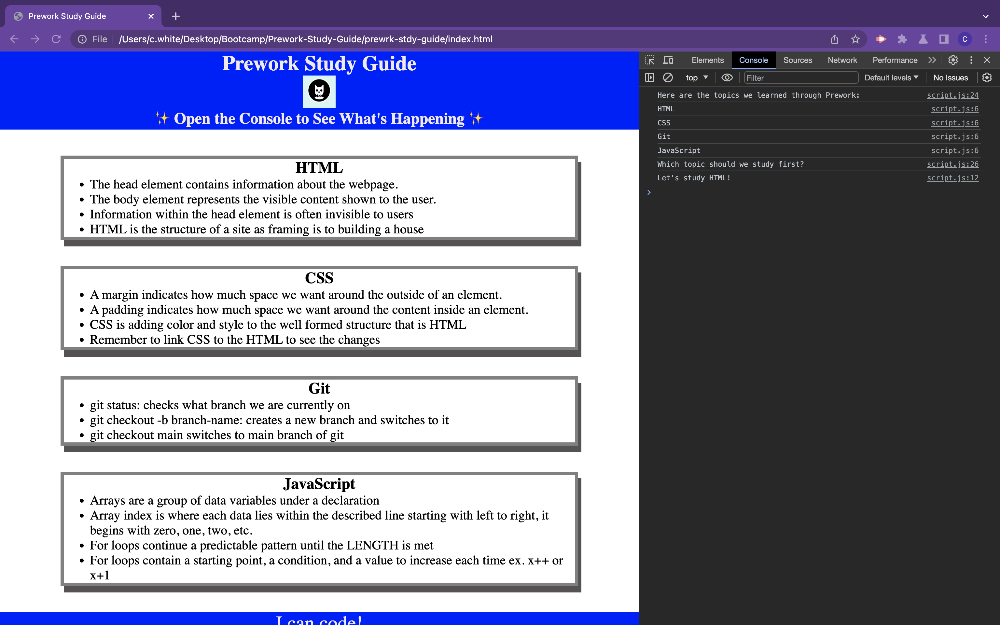

# Prework-Study-Guide

## Description

This site was created as a study guide for boot camp students who are completing the course prework. The goal was to have a site that contains notes in an organized manner using the topics given. It was completed using HTML, CSS, git, and JavaScript.

## Installation 
N/A

## Usage

To use this study guide, one can review the notes within each section. These sections include HTML, CSS, git, and JavaScript. If you're not sure what to study first, open the Chrome DevTools by pressing `Command+Option+I` (MacOS) or `Control+Shift+I` (Windows). 

()

A panel will then appear in the browser where you can select the "Console" tab where will see the JavaScript running in real time. There is also a list of topics learned from the Prework. If you're not sure what to study first, a randomized suggestion will appear at the bottom with what to study!

## Credits

N/A

## License

Please refer to the LICENSE in the repo.